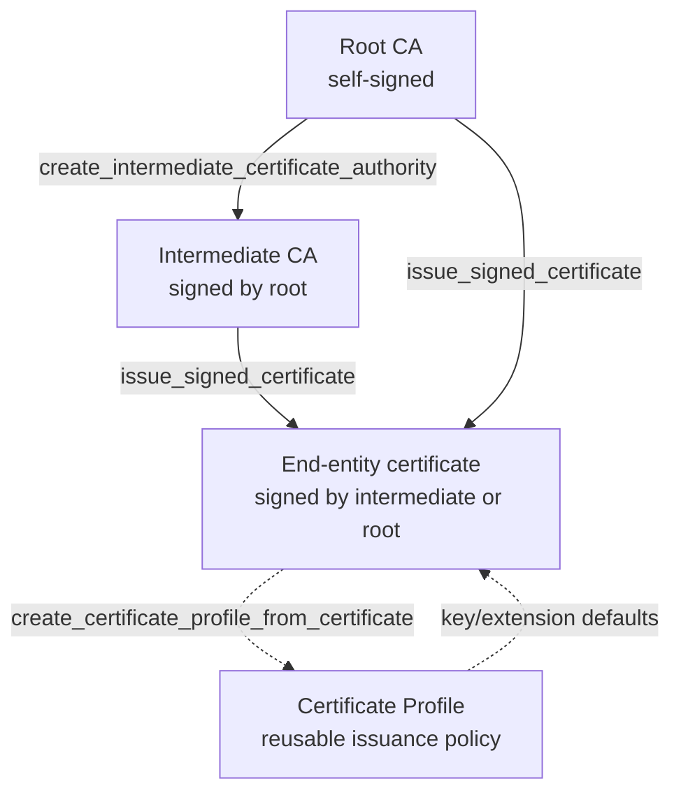

# PKI Workbench

PKI Workbench is a Django-based certificate authority management application
for building and operating private PKI workflows. It supports root/intermediate
CAs, end-entity issuance, certificate profiles, artifact downloads, and a REST
API surface for integration.

!!! warning "Not yet production-ready"
    PKI Workbench is suitable for development, testing, and internal
    prototyping. Before production deployment, complete hardening tasks such
    as secure secret management, strict host/TLS config, production-grade
    database/storage choices, observability, backup/recovery strategy, and
    security review. See the
    [Production Readiness Checklist](guide/production-checklist.md).

## Major Features

- Root CA creation with configurable key algorithm and certification depth
- Intermediate CA creation with depth validation against root policy
- End-entity certificate issuance with:
  - Key algorithm/curve/key-size controls
  - SAN DNS support
  - Key Usage and Extended Key Usage controls
- Certificate Profiles for reusable issuance policy
  - Key/extension defaults
  - Optional subject constraints
  - Derive profile from an issued certificate
  - Edit profiles via UI
- Artifact management
  - Certificate detail page
  - Download public cert, cert chain, CSR, and cert/key bundle zip
  - Consistent artifact filename conventions
- CA Workbench UX
  - Trust chain links
  - Searchable CA and profile selectors
  - Profile-driven issue form auto-fill and field locking
- Home dashboard
  - Counts (CAs, certificates, profiles)
  - Certificates closest to expiration
  - Recursive, clickable CA hierarchy
- REST API (`/api/`)
  - Owner-scoped resources for CAs, certificates, and profiles
  - Dashboard endpoint
  - Workflow endpoints that call existing validated domain workflows
  - OpenAPI schema endpoint at `/api/schema/`

## Tech Stack

- Python 3.11+
- Django 6
- Django REST Framework
- `cryptography`
- `django-environ`
- `django-filter`

## CA hierarchy and issuance flow

Every CA and certificate is owned by a user. Profiles are optional issuance
policy templates: create one from scratch or derive one from an existing
certificate, then reuse it to auto-fill and lock fields when issuing new
certificates.

## Where to start

- New to PKI Workbench? Start with [Installation](guide/installation.md) and
  [Configuration](guide/configuration.md).
- Integrating with the REST API? See the [API Quick Start](guide/api-quick-start.md).
- Automating from the command line? See the [CLI guide](guide/cli.md).
- Deploying beyond local development? See the
  [Production Readiness Checklist](guide/production-checklist.md).
- Looking for exact signatures? See the [Reference](reference/index.md)
  section.

## License

PKI Workbench is licensed under the GNU General Public License v3.0
(GPLv3). See the repository `LICENSE` file for details.
